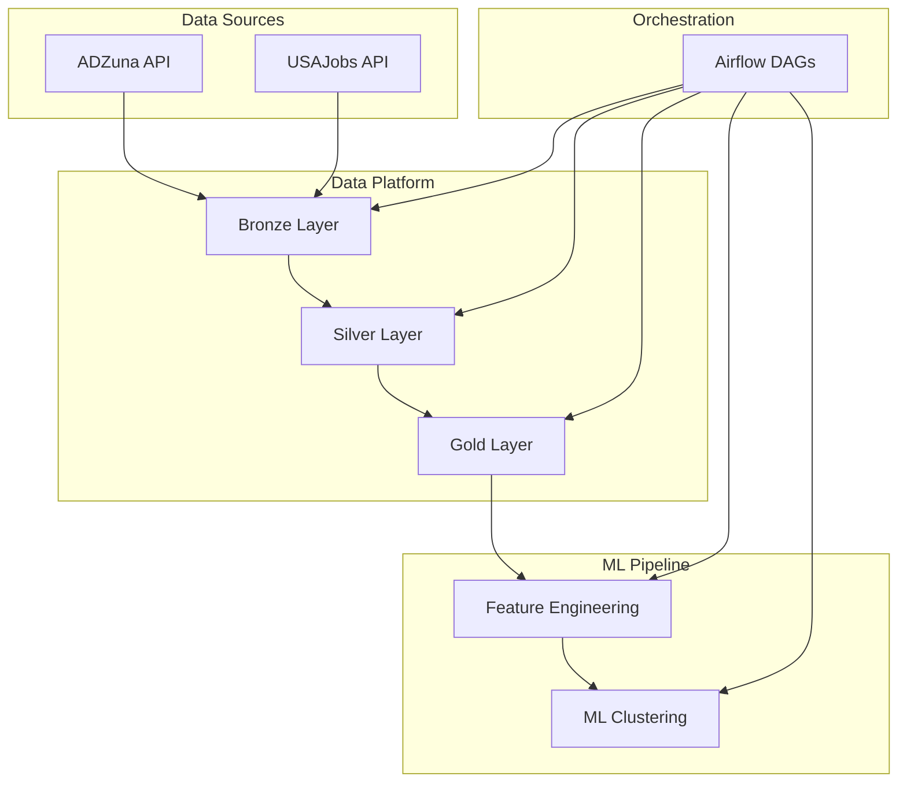

# Real-Time Job Market Intelligence Platform

[](https://www.python.org/)
[](https://python-poetry.org/)
[](https://spark.apache.org/)
[]

A production-style **data engineering and ML platform** that ingests job postings from ADZuna and USAJobs, cleans, enriches, and transforms the data into an analytics-ready star schema. Includes ML pipelines for **skill/job embeddings** and **dynamic job clustering**. Built with **PySpark**, **Poetry**, **pytest**, and a Typer CLI for flexible execution.

---

## Table of Contents

1. [Why This Project](#why-this-project)  
2. [Overview](#overview)  
3. [Architecture](#architecture)  
3. [Medallion Pipeline](#medallion-pipeline)  
4. [ML Pipeline](#ml-pipeline)  
5. [Orchestration (Airflow)](#orchestration-(airflow))  
6. [Project Structure](#project-structure)  
7. [Getting Started](#getting-started)  
8. [Configuration](#configuration)  
9. [Observability & Reliability](#observability-&-reliability)  
10. [Testing](#testing)  
11. [Future Improvements](#future-improvements)

---

## Why This Project

Modern job markets generate large volumes of unstructured and fast-changing data, making it difficult to extract meaningful insights about skills demand, job trends, and role similarities.

This project was built to simulate a **real-world data platform** that transforms raw job postings into actionable intelligence through scalable data engineering and machine learning workflows.

### Problems Addressed

* **Fragmented and unstructured data**
  Job postings from different APIs (ADZuna, USAJobs) have inconsistent schemas and formats.

* **Lack of analytics-ready structure**
  Raw data is not directly usable for analysis or reporting without cleaning, normalization, and modeling.

* **Difficulty in extracting insights from text**
  Skills and job similarities are embedded in unstructured descriptions and require NLP techniques.

* **Need for reliable and repeatable pipelines**
  Data workflows must be orchestrated, monitored, and resilient to failures.

### What This Project Demonstrates

This platform showcases end-to-end data engineering capabilities:

* Designing a **medallion architecture** (Bronze → Silver → Gold)
* Building **modular, testable pipeline stages**
* Managing **incremental data processing and partitioning**
* Implementing **Airflow orchestration with dependencies, retries, and scheduling**
* Creating **environment-aware configurations** for local and production setups
* Integrating **machine learning pipelines** into a data platform
* Applying **data validation and observability practices**

### Key Takeaways

Through this project, I focused on writing code that is not just functional, but **production-oriented**:

* Pipelines are **decoupled from orchestration** via a CLI interface
* Configuration is **centralized and environment-driven**
* Each stage enforces **input/output validation and quality checks**
* The system is designed to be **extensible**, allowing new data sources or ML models to be added easily

Overall, the goal was to bridge the gap between **data engineering and machine learning**, building a platform that reflects how modern data systems are designed and operated in practice.

---

## Overview

This project demonstrates a full **data engineering workflow**:

- Ingests job postings from multiple APIs
- Stores raw and processed data with **partitioning**
- Cleans, deduplicates, and enriches the data
- Builds a **star-schema** data warehouse (dimensions + fact tables)
- Performs **feature extraction** and **ML clustering**
- Uses **PySpark**, **Poetry**, **pytest**, and **Typer** CLI

It is designed with **production-ready patterns**:

- Stage execution framework with input/output validation  
- Incremental partition processing  
- Metrics computation and evaluation  
- Configurable runtime via `settings.yaml`  

---

## Architecture



---

## Orchestration (Airflow)

The platform is orchestrated using Apache Airflow, with separate DAGs for each pipeline layer:

- **ingestion_dag** (hourly)
  - Ingests raw job postings into the Bronze layer

- **processing_dag** (daily)
  - Transforms Bronze → Silver → Gold
  - Depends on ingestion completion via `ExternalTaskSensor`

- **ml_dag** (weekly)
  - Runs feature engineering and ML clustering
  - Depends on Gold layer completion

### Key Features

- **Task dependencies across DAGs** using `ExternalTaskSensor`
- **Environment parameterization** via Airflow `params`
- **Retries and timeouts** for production reliability
- **CLI-based execution** for decoupled orchestration

### Example DAG Flow


---

## Medallion Pipeline

### Bronze

- Stores **raw JSON payload** from ADZuna and USAJobs
- Adds metadata such ingestion date and run ID

### Silver

- Cleans, deduplicates and normalizes job postings 
- Extracts skills from job descriptions 
- Ensure data integrity and quality 

### Gold 

- Creates analytics-ready **star schema**:
  - dim_jobs
  - dim_skills
  - fact_job_skills
- Performs validation and metrics checks 

## ML Pipeline 

### Feature Stage 

- Generates embeddings for jobs and skills using **SentenceTransformer** (all-MiniLM-L6-v2) 
- Stores embeddings for downstream ML tasks 

### ML Stage 

- Performs **job clustering** using PySpark KMeans 
- Dynamic cluster number search 
- Evaluates clustering quality using metrics defined in settings.yaml 

--- 

## Project Structure 

```
my_project/
├── data/ # Raw and processed datasets
├── docs/ # Documentation (mkdocs)
├── logs/ # Logs for pipeline runs
├── models/ # ML models and embeddings
├── notebooks/ # Exploratory notebooks
├── reports/ # Figures, metrics, and reports
├── settings.yaml # Runtime configuration
├── pyproject.toml # Poetry project config
├── src/job_plat/ # Main source code
│ ├── cli.py # CLI entry points
│ ├── config/ # Config loaders and logging setup
│ ├── context/ # Stage context builders
│ ├── ingestion/ # API connectors and raw schema
│ ├── orchestration/ # Pipeline runners
│ ├── partitioning/ # Partition management
│ ├── pipeline/ # Stages (Bronze, Silver, Gold, ML)
│ ├── transformations/ # ETL and ML transformations
│ └── utils/ # Helpers and I/O utilities
└── tests/ # Unit and integration tests

```

--- 

## Getting Started 

### Install dependencies 

```bash
poetry install
```

### Running the data pipeline 

```bash
poetry run python -m job_plat.cli bronze
poetry run python -m job_plat.cli silver
poetry run python -m job_plat.cli gold
poetry run python -m job_plat.cli data-pipeline
```

### Running the ML pipeline 

```bash
poetry run python -m job_plat.cli feature
poetry run python -m job_plat.cli ml
poetry run python -m job_plat.cli ml-pipeline
```

--- 

## Configuration 

All runtime parameters are defined in `settings.yaml`, with support for multiple environments:

```yaml
environments:
  dev:
    storage:
      type: local
    paths:
      root: ./data
      metadata: ./metadata

  prod:
    storage:
      type: gcs
    paths:
      root: gs://job-pipeline
      metadata: gs://job-pipeline/metadata
```

### Key Features

- **Environment-aware configuration** (dev, prod)
- Automatic **path resolution and normalization**
- Support for **local and cloud storage (GCS)**
- Centralized configuration via ConfigLoader

Pipeline can be execute with a specific environment:

```bash
poetry run python -m job_plat.cli silver --env dev
```

--- 

## Observability & Reliability

The platform includes several production-oriented features:

- **Airflow retries and timeouts**
- Structured logging for each pipeline stage
- Execution time tracking for tasks
- Input/output validation in each stage
- Data quality checks (e.g., non-empty outputs)

These features ensure robustness and make debugging easier in distributed environments.

---

## Testing 

Automated tests ensure data and ML integrity: 

```bash
pytest
```

- Unit tests validate transformations

- Integration tests validate stage execution and pipeline flow

--- 

## Future Improvements 

- Containerization with Docker for reproducibility
- Integration with cloud orchestration (e.g., GCP Composer)
- Advanced data quality checks (Great Expectations)
