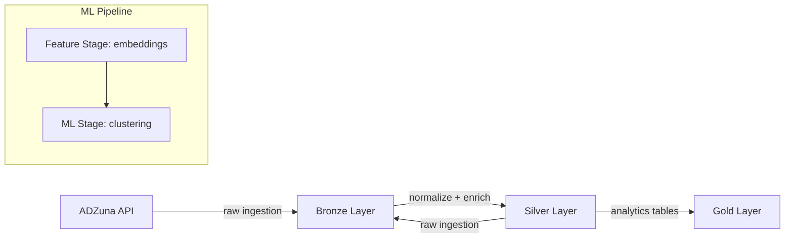

# Real-Time Job Market Intelligence Platform

[](https://www.python.org/)
[](https://python-poetry.org/)
[](https://spark.apache.org/)

A production-style **data engineering and ML pipeline** to ingest, transform, and analyze job postings from public APIs (ADZuna, USAJobs) using a **medallion architecture** (Bronze → Silver → Gold) and perform **job clustering with embeddings**.

---

## Table of Contents

1. [Overview](#overview)  
2. [Architecture](#architecture)  
3. [Medallion Pipeline](#medallion-pipeline)  
4. [ML Pipeline](#ml-pipeline)  
5. [Project Structure](#project-structure)  
6. [Getting Started](#getting-started)  
7. [Configuration](#configuration)  
8. [Testing](#testing)  
9. [Future Improvements](#future-improvements)

---

## Overview

This project demonstrates a full **data engineering workflow**:

- Ingests job postings from multiple APIs
- Stores raw and processed data with **partitioning**
- Cleans, deduplicates, and enriches the data
- Builds a **star-schema** data warehouse (dimensions + fact tables)
- Performs **feature extraction** and **ML clustering**
- Uses **PySpark**, **Poetry**, **pytest**, and **Typer** CLI

It is designed with **production-ready patterns**:

- Stage execution framework with input/output validation  
- Incremental partition processing  
- Metrics computation and evaluation  
- Configurable runtime via `settings.yaml`  

---

## Architecture



---

## Medallion Pipeline

### Bronze

- Stores **raw JSON payload** from ADZuna and USAJobs
- Adds metadata such ingestion date and run ID

### Silver

- Cleans, deduplicates and normalizes job postings 
- Extracts skills from job descriptions 
- Ensure data integrity and quality 

### Gold 

- Creates analytics-ready **star schema**:
  - dim_jobs
  - dim_skills
  - fact_job_skills
- Performs validation and metrics checks 

## ML Pipeline 

### Feature Stage 

- Generates embeddings for jobs and skills using **SentenceTransformer** (all-MiniLM-L6-v2) 
- Stores embeddings for downstream ML tasks 

### ML Stage 

- Performs **job clustering** using PySpark KMeans 
- Dynamic cluster number search 
- Evaluates clustering quality using metrics defined in settings.yaml 

--- 

## Project Structure 

```
├── data
├── docs
│   ├── docs
│   │   ├── getting-started.md
│   │   └── index.md
│   ├── mkdocs.yml
│   └── README.md
├── logs
│   ├── error.log
│   └── info.log
├── Makefile
├── metadata
│   └── partitions_metadata.json
├── models
├── mypy.ini
├── notebooks
├── poetry.lock
├── pyproject.toml
├── README.md
├── reports
│   └── figures
├── ruff.toml
├── settings.yaml
├── src
│   └── job_plat
│       ├── cli.py
│       ├── config
│       │   ├── config_loader.py
│       │   ├── env_config.py
│       │   ├── __init__.py
│       │   ├── logconfig.py
│       ├── context
│       │   ├── context_builders.py
│       │   ├── contexts.py
│       ├── ingestion
│       │   ├── connectors.py
│       │   ├── job_schema.py
│       │   ├── metadata.py
│       │   └── search_criteria.py
│       ├── __init__.py
│       ├── orchestration
│       │   ├── data_pipeline.py
│       │   ├── ml_pipeline.py
│       ├── partitioning
│       │   ├── partition_manager.py
│       ├── pipeline
│       │   ├── core
│       │   │   ├── base_model_stage.py
│       │   │   ├── base_source_stage.py
│       │   │   ├── base_stage.py
│       │   │   └── read_strategy.py
│       │   ├── datasets
│       │   │   ├── dataset_definitions.py
│       │   │   ├── dataset.py
│       │   │   ├── dataset_registry.py
│       │   └── stages
│       │       ├── data
│       │       │   ├── bronze_stage.py
│       │       │   ├── gold_stage.py
│       │       │   └── silver_stage.py
│       │       ├── ml
│       │       │   ├── feature_stage.py
│       │       │   ├── ml_stage.py
│       ├── schemas
│       │   ├── output_schemas.py
│       ├── storage
│       │   └── storages.py
│       ├── transformations
│       │   ├── bronze
│       │   │   └── validation
│       │   │       └── validate.py
│       │   ├── gold
│       │   │   ├── v1_analytics
│       │   │   │   ├── build_dimensions.py
│       │   │   │   ├── fact_job_skills.py
│       │   │   └── v2_intelligence
│       │   │       ├── clusters
│       │   │       │   ├── build_job_clusters.py
│       │   │       └── embeddings
│       │   │           ├── build_job_embeddings.py
│       │   │           ├── build_skill_embeddings.py
│       │   │           ├── embedding_skill_normalizer.py
│       │   └── silver
│       │       ├── cleaning
│       │       │   ├── clean_jobs.py
│       │       ├── enrichment
│       │       │   ├── build_job_skills.py
│       │       │   ├── extract_skills.py
│       │       │   ├── skills.py
│       │       │   └── spark_ops.py
│       │       └── validation
│       │           └── quality_checks.py
│       └── utils
│           ├── helpers.py
│           ├── __init__.py
│           ├── io.py
└── tests
    ├── conftest.py
    ├── fixtures
    │   ├── contexts.py
    │   ├── datasets.py
    │   ├── partition_manager.py
    │   ├── sample_dataframe.py
    │   └── sample_data.py
    ├── integration
    │   ├── test_gold_stage.py
    │   └── test_silver_stage.py
    └── unit
        ├── datasets
        │   ├── test_dataset.py
        │   └── test_partition_manager.py
        ├── read_strategy
        │   └── test_read_strategy.py
        ├── test_clean_extract.py
        ├── test_stages.py
        ├── test_write_jsonl.py
        └── transformations
            ├── test_gold_dim_jobs.py
            ├── test_silver_clean_jobs.py
            └── test_silver_enrich.py

```

--- 

## Getting Started 

### Install dependencies 

```bash
poetry install
```

### Running the data pipeline 

```bash
poetry run python bronze
poetry run python silver
poetry run python gold
poetry run python data-pipeline
```

### Running the ML pipeline 

```bash
poetry run python feature
poetry run python ml
poetry run python ml-pipeline
```

--- 

## Configuration 

All runtime parameters are in settings.yaml. Examples:

- Local storage root path

- Metric thresholds for stages

- Stage-specific settings (Bronze, Silver, Gold, Feature, ML)

You can load configurations programmatically using the ConfigLoader class. 

--- 

## Testing 

Automated tests ensure data and ML integrity: 

```bash
pytest
```

- Unit tests validate transformations

- Integration tests validate stage execution and pipeline flow

--- 

## Future Improvements 

- Add **Airflow** orchestration 
- Containerized with Docker for reproducibility 
- Introduce **Great Expectations** data quality checks
