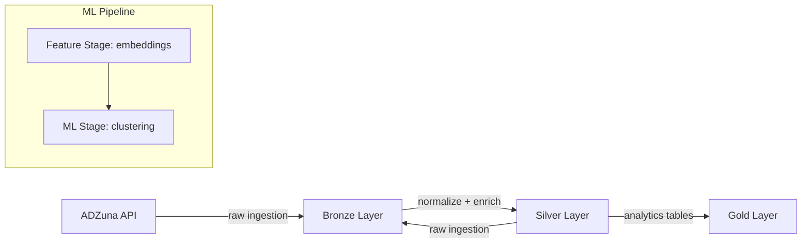

# Real-Time Job Market Intelligence Platform

[](https://www.python.org/)
[](https://python-poetry.org/)
[](https://spark.apache.org/)
[]

A production-style **data engineering and ML platform** that ingests job postings from ADZuna and USAJobs, cleans, enriches, and transforms the data into an analytics-ready star schema. Includes ML pipelines for **skill/job embeddings** and **dynamic job clustering**. Built with **PySpark**, **Poetry**, **pytest**, and a Typer CLI for flexible execution.

---

## Table of Contents

1. [Overview](#overview)  
2. [Architecture](#architecture)  
3. [Medallion Pipeline](#medallion-pipeline)  
4. [ML Pipeline](#ml-pipeline)  
5. [Project Structure](#project-structure)  
6. [Getting Started](#getting-started)  
7. [Configuration](#configuration)  
8. [Testing](#testing)  
9. [Future Improvements](#future-improvements)

---

## Overview

This project demonstrates a full **data engineering workflow**:

- Ingests job postings from multiple APIs
- Stores raw and processed data with **partitioning**
- Cleans, deduplicates, and enriches the data
- Builds a **star-schema** data warehouse (dimensions + fact tables)
- Performs **feature extraction** and **ML clustering**
- Uses **PySpark**, **Poetry**, **pytest**, and **Typer** CLI

It is designed with **production-ready patterns**:

- Stage execution framework with input/output validation  
- Incremental partition processing  
- Metrics computation and evaluation  
- Configurable runtime via `settings.yaml`  

---

## Architecture



---

## Medallion Pipeline

### Bronze

- Stores **raw JSON payload** from ADZuna and USAJobs
- Adds metadata such ingestion date and run ID

### Silver

- Cleans, deduplicates and normalizes job postings 
- Extracts skills from job descriptions 
- Ensure data integrity and quality 

### Gold 

- Creates analytics-ready **star schema**:
  - dim_jobs
  - dim_skills
  - fact_job_skills
- Performs validation and metrics checks 

## ML Pipeline 

### Feature Stage 

- Generates embeddings for jobs and skills using **SentenceTransformer** (all-MiniLM-L6-v2) 
- Stores embeddings for downstream ML tasks 

### ML Stage 

- Performs **job clustering** using PySpark KMeans 
- Dynamic cluster number search 
- Evaluates clustering quality using metrics defined in settings.yaml 

--- 

## Project Structure 

```
my_project/
├── data/ # Raw and processed datasets
├── docs/ # Documentation (mkdocs)
├── logs/ # Logs for pipeline runs
├── models/ # ML models and embeddings
├── notebooks/ # Exploratory notebooks
├── reports/ # Figures, metrics, and reports
├── settings.yaml # Runtime configuration
├── pyproject.toml # Poetry project config
├── src/job_plat/ # Main source code
│ ├── cli.py # CLI entry points
│ ├── config/ # Config loaders and logging setup
│ ├── context/ # Stage context builders
│ ├── ingestion/ # API connectors and raw schema
│ ├── orchestration/ # Pipeline runners
│ ├── partitioning/ # Partition management
│ ├── pipeline/ # Stages (Bronze, Silver, Gold, ML)
│ ├── transformations/ # ETL and ML transformations
│ └── utils/ # Helpers and I/O utilities
└── tests/ # Unit and integration tests

```

--- 

## Getting Started 

### Install dependencies 

```bash
poetry install
```

### Running the data pipeline 

```bash
poetry run python bronze
poetry run python silver
poetry run python gold
poetry run python data-pipeline
```

### Running the ML pipeline 

```bash
poetry run python feature
poetry run python ml
poetry run python ml-pipeline
```

--- 

## Configuration 

All runtime parameters are in settings.yaml. Examples:

- Local storage root path

- Metric thresholds for stages

- Stage-specific settings (Bronze, Silver, Gold, Feature, ML)

You can load configurations programmatically using the ConfigLoader class. 

--- 

## Testing 

Automated tests ensure data and ML integrity: 

```bash
pytest
```

- Unit tests validate transformations

- Integration tests validate stage execution and pipeline flow

--- 

## Future Improvements 

- Add **Airflow** orchestration 
- Containerized with Docker for reproducibility 
- Introduce **Great Expectations** data quality checks
