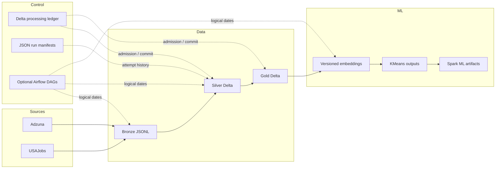

# Real-Time Job Market Intelligence Platform

[](https://github.com/ScriptFizz/Real-Time-Job-Market-Intelligence-Platform/actions/workflows/ci.yml)
[](https://codecov.io/gh/ScriptFizz/Real-Time-Job-Market-Intelligence-Platform)
[](https://github.com/ScriptFizz/Real-Time-Job-Market-Intelligence-Platform/actions/workflows/ci.yml)
[](https://github.com/ScriptFizz/Real-Time-Job-Market-Intelligence-Platform/actions/workflows/ci.yml)
[](https://www.python.org/)

A production-oriented portfolio platform for ingesting job postings, building a
Spark medallion pipeline, creating versioned embeddings, and training job-cluster
models. It emphasizes deterministic retries, transactional Delta tables, data
contracts, model artifacts, and observable stage execution.

This repository demonstrates application and data-platform engineering patterns.
It is not a turnkey hosted production system; see
[Local and cloud guarantees](#local-and-cloud-guarantees).

## What it demonstrates

- Adzuna and USAJobs connectors with bounded retries, `Retry-After`, defensive
  decoding, schema-error accounting, and credential-safe logging.
- Bronze JSONL landing data followed by Silver, Gold, Feature, and ML Delta
  tables.
- Atomic keyed merges and partition replacement with optimistic-concurrency
  retries.
- A concurrency-safe processing ledger and deterministic logical batch IDs.
- Retry-idempotent multi-output stages with explicit non-transactional boundaries.
- Logical execution dates for reproducible CLI and Airflow backfills.
- Versioned skill/job embeddings with bounded driver cardinality and batching.
- Deterministic KMeans training identities, persisted Spark model artifacts,
  training fingerprints, and explicit candidate/promotion semantics.
- JSON logs, run manifests, row counts, completeness/freshness metrics, and
  pre-write schema/nullability/uniqueness contracts.
- Ruff, MyPy, pytest, package-build, CLI, DAG, and coverage checks in CI.

## Architecture


```mermaid
flowchart LR
    subgraph Sources
        A[Adzuna]
        U[USAJobs]
    end
    subgraph Data
        B[Bronze JSONL]
        S[Silver Delta]
        G[Gold Delta]
    end
    subgraph ML
        F[Versioned embeddings]
        M[KMeans outputs]
        R[Spark ML artifacts]
    end
    subgraph Control
        L[Delta processing ledger]
        O[JSON run manifests]
        AF[Optional Airflow DAGs]
    end

    A --> B
    U --> B
    B --> S --> G --> F --> M --> R
    L -. admission / commit .-> S
    L -. admission / commit .-> G
    O -. attempt history .-> S
    AF -. logical dates .-> B
    AF -. logical dates .-> S
    AF -. logical dates .-> F
```

Detailed guarantees and failure boundaries are documented in
[Architecture and operational guarantees](docs/architecture.md). The table-format
decision is recorded in
[ADR 0001: Delta Lake](docs/adr/0001-delta-lake-table-format.md).

## Pipeline

| Stage | Responsibility | Persistence |
|---|---|---|
| Bronze | Fetch, normalize, retain raw payload and ingestion metadata | Partitioned JSONL |
| Silver | Clean, deduplicate, normalize, and extract skills | Partitioned Delta |
| Gold | Produce job/skill dimensions and job-skill facts | Delta |
| Feature | Build only missing entity/model-version embeddings | Delta |
| ML | Select K, assign clusters, persist metrics and model artifacts | Delta + Spark ML artifacts |

Bronze is source-preserving. Managed tables use Delta because application-level
Parquet overwrite merges were not transaction-safe. Feature merge keys include
the embedding model version; ML merge keys include a deterministic model ID.

## Retry and concurrency semantics

- A logical partition batch has a deterministic identity.
- Only one live attempt for the same stage and batch is admitted by the Delta
  processing ledger.
- Individual Delta writes are atomic and recognized optimistic-concurrency
  conflicts receive bounded retries.
- Processing state is acknowledged only after all stage outputs are written.
- A failed acknowledgement can be retried because table operations are
  idempotent.
- Multiple output tables are **not** a distributed transaction. Downstream
  readiness is defined by committed ledger state, not by file presence.
- Empty incremental windows are successful `no_op` runs. Stages reject empty
  outputs unless they explicitly support this behavior.

## Getting started

Requirements for host execution:

- Python 3.11
- Java 17
- Poetry 2.4.x

```bash
poetry install --with dev
poetry run job-plat --help
```

Optional dependency groups:

```bash
poetry install --with dev,airflow  # DAG development and serialization tests
poetry install --with cloud        # Google Cloud Storage client
```

Common commands:

```bash
poetry run job-plat bronze --env dev --execution-date 2026-08-24T00:00:00Z
poetry run job-plat silver --env dev --execution-date 2026-08-24T00:00:00Z
poetry run job-plat gold --env dev --execution-date 2026-08-24T00:00:00Z
poetry run job-plat feature --env dev --execution-date 2026-08-24T00:00:00Z
poetry run job-plat ml --env dev --execution-date 2026-08-24T00:00:00Z
```

Live Bronze ingestion requires credentials for each connector enabled in
`settings.yaml`. Copy `.env.example` to `.env` and supply secrets locally.

## Docker local stack

```bash
docker compose build
docker compose run --rm job-platform --help
docker compose run --rm job-platform silver \
  --env dev \
  --execution-date 2026-08-24T00:00:00Z
```

The Compose stack mounts local data, metadata, artifacts, and logs. It packages
the CPU-only CLI runtime; it intentionally does not pretend to be an Airflow,
YARN, or cloud production cluster. See [Local stack](docs/local-stack.md).

## Airflow orchestration

Airflow is optional. The repository contains separately scheduled ingestion,
processing, and ML DAGs that pass Airflow logical dates to the CLI. Cross-DAG
sensors align logical intervals, and DAG import/serialization is tested.

The repository does not provision an Airflow metadata database, executor,
workers, remote logging, or alerting. Those are deployment responsibilities.

## Configuration

`settings.yaml` contains `dev` and illustrative `prod` profiles. Configuration
controls paths, Spark settings, connectors, HTTP retry policy, embedding model
identity and batching, clustering parameters, artifacts, and promotion behavior.

Secrets are environment variables, not YAML values:

```dotenv
ADZUNA_APP_ID=...
ADZUNA_API_KEY=...
USAJOBS_EMAIL=...
USAJOBS_API_KEY=...
```

## Observability and data contracts

Each stage emits JSON logs correlated with run, batch, partition, and model
identity. Durable manifests under
`<metadata>/run_manifests/<stage>/<run_id>.json` record status, timestamps,
inputs, outputs, metrics, and safe failure details.

Before writes, dataset contracts enforce required columns, selected physical
types, nullability, and uniqueness. Dataset observations include input/output row
counts, completeness ratios, freshness values, rejected records, and dead-letter
counts. The processing ledger remains the scheduling/concurrency source of truth;
manifests are the attempt-level operational history.

## Local and cloud guarantees

The local profile is executable and tested on a single Spark process. It
demonstrates transactional table behavior, retries, contracts, artifacts, and
observability, but not high availability or distributed infrastructure.

The `prod` profile and GCS backend are deployment-ready interfaces, not a hosted
environment. A real cloud deployment must supply a Spark/YARN runtime, Hadoop GCS
connector, workload identity, Airflow infrastructure, secret management, remote
logs, alerting, capacity planning, and backup/restore procedures. GCS control and
data paths are implemented and contract-tested with fakes; this repository's CI
does not execute an end-to-end job against a real GCS account.

## Engineering decisions and trade-offs

- **Delta over plain Parquet:** transactions and concurrency are delegated to a
  table format rather than reimplemented with unsafe read/overwrite cycles.
- **Delta over Iceberg for now:** the project uses one Spark engine and no shared
  catalog; Iceberg becomes more attractive for a multi-engine platform.
- **Processing ledger plus manifests:** the ledger coordinates concurrency;
  manifests explain individual attempts. Combining both responsibilities would
  make retries and audit history harder to reason about.
- **At-least-once execution with idempotent writes:** exactly-once behavior is
  approached through deterministic identities and convergent writes, not claimed
  as a distributed guarantee.
- **Bounded driver embedding:** skills are batched and guarded. This is practical
  for the project scale; executor-side inference would be the next step for very
  high cardinality.
- **Explicit model promotion:** training creates candidates by default. A model is
  active only after promotion; the newest promoted run wins.
- **Optional Airflow/cloud dependencies:** the core CLI remains testable without
  installing deployment-specific runtimes.

## Quality checks

```bash
poetry run ruff format --check src tests
poetry run ruff check src tests
poetry run mypy src --no-incremental
PYTHONDONTWRITEBYTECODE=1 SPARK_LOCAL_IP=127.0.0.1 \
  poetry run pytest -p no:cacheprovider -q
poetry build
```

CI performs these checks on Ubuntu with Python 3.11 and Java 17 and publishes a
coverage report to Codecov.

## Repository layout

```text
src/job_plat/
├── config/           # Pydantic configuration and JSON logging
├── context/          # Typed stage contexts
├── dags/             # Optional Airflow DAGs
├── ingestion/        # Connectors, canonical schema, Bronze metadata
├── observability/    # Run manifests
├── orchestration/    # CLI-independent pipeline runners
├── partitioning/     # Delta processing ledger and batch admission
├── pipeline/         # Dataset contracts, read strategies, stage framework
├── storage/          # Local/GCS storage and Delta conflict retries
└── transformations/  # Silver, Gold, Feature, and ML logic
```

## Deferred credential-free demo

Captured CLI output and generated data examples are intentionally deferred until
a deterministic synthetic Bronze-data generator is added. This avoids publishing
expired credentials, unstable API results, or fabricated output. The intended
follow-up is a credential-free demo command plus small, license-safe fixtures.
