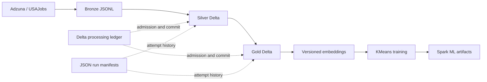

# Architecture and operational guarantees

## Data flow

Bronze preserves raw source records alongside canonical payloads. Managed tables
from Silver onward use Delta Lake. Feature tables are keyed by entity and model
version. ML outputs and saved Spark models use a deterministic training identity
containing configuration, logical training time, and a data fingerprint.

## Retry and concurrency semantics

- A partition batch has a deterministic ID.
- The Delta processing ledger admits one live attempt for a stage/batch and
  rejects or serializes competing attempts.
- Data is acknowledged only after every output write succeeds.
- Keyed merges and partition replacement are individually transactional and
  retry-safe.
- Recognized Delta optimistic-concurrency conflicts receive bounded retries.
- If acknowledgement fails after writes, rerunning converges to the same table
  state.
- Multiple output tables do **not** form a distributed transaction. Consumers
  should use committed ledger state rather than file presence as readiness.
- Empty incremental windows are recorded as successful `no_op` runs. Empty
  outputs remain errors unless the stage explicitly allows an incremental no-op.

## Local and cloud guarantees

The local profile is reproducible on one machine using Docker Compose or Poetry.
It demonstrates table transactions, retry identity, schema contracts, run
manifests, and local Spark execution. It does not demonstrate high availability,
distributed scheduling, secret rotation, or disaster recovery.

The `prod` profile supplies GCS paths and a YARN-oriented Spark configuration,
and the storage/state code supports GCS object operations. A real deployment must
still provide a Spark/YARN cluster, Hadoop GCS connector, workload identity or
service-account credentials, a shared artifact cache, Airflow metadata database,
remote log storage, alerting, and infrastructure-level scaling. Consequently,
`--env prod` is a deployment contract and configuration example—not a turnkey
hosted production environment.

Airflow DAGs are import- and serialization-tested and invoke the same CLI with
logical execution dates. Airflow is an optional dependency; this repository does
not ship a production Airflow cluster.
